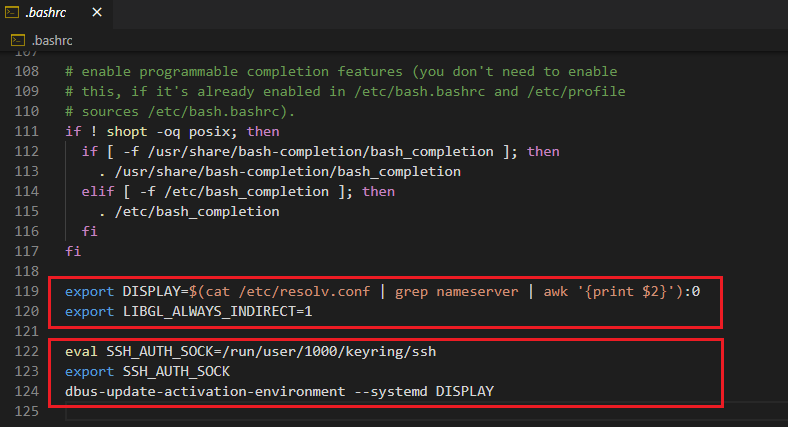

# wsl2-vscode
How to setup Linux Native VS Code on WSL2 Ubuntu

## Install VS Code with Snap

> ref : https://code.visualstudio.com/docs/setup/linux

1. [Install X-Server for GUI Rendering](https://sourceforge.net/projects/vcxsrv/)
    - Configurations
        - Configure Launch Setting
            1. Windows Firewall & network protection -> Allow VcXsrv on Domain / Public / Private checked
            2. Launch VcXsrv with "Disable access control" checked
        - Configure `~/.bashrc`
            ```sh
            echo "export DISPLAY='$(cat /etc/resolv.conf | grep nameserver | awk '{print $2}'):0'" >> ~/.bashrc
            echo "export LIBGL_ALWAYS_INDIRECT=1" >> ~/.bashrc
            ```

2. [Install Snap for VS Code Installation](https://snapcraft.io/docs/installing-snap-on-ubuntu)
    - Prerequisites
        1. [Install **ubuntu-wsl2-systemd-script** to enable systemd](https://github.com/damionGans/ubuntu-wsl2-systemd-script)

3. Install VS Code
    ```sh
    sudo snap install --classic code # or code-insiders
    ```

## Run VS Code

```sh
snap run code
# and type y <Enter> to pass the prompt
```
> If you run `code` command with out `snap run`, it'll be launch The Windows Native VS Code.

## Using Settings Sync (Built in VS Code)

> ref : https://code.visualstudio.com/docs/editor/settings-sync

1. [Install GNOME Keyring for Settings Sync](https://wiki.archlinux.org/index.php/GNOME/Keyring#Installation)
    - Configurations
        - Configure `~/.bashrc`
            ```sh
            echo "eval $(/usr/bin/gnome-keyring-daemon --start --components=gpg,pkcs11,secrets,ssh)" >> ~/.bashrc
            echo "export SSH_AUTH_SOCK" >> ~/.bashrc
            echo "dbus-update-activation-environment --systemd DISPLAY" >> ~/.bashrc
            ```
    - Optional
        - If you want to use GUI-Tool, install seahorse too

2. [Install Firefox for Settings Sync](https://linuxconfig.org/how-to-install-uninstall-and-update-firefox-on-ubuntu-18-04-bionic-beaver-linux#h6-1-install-and-update-firefox-from-ubuntu-repository)
    - Configurations
        - [Make sure to default web browser](https://wiki.debian.org/DefaultWebBrowser#Default_for_foreign_programs_.28user-specific.29)

## `~/.bashrc`


